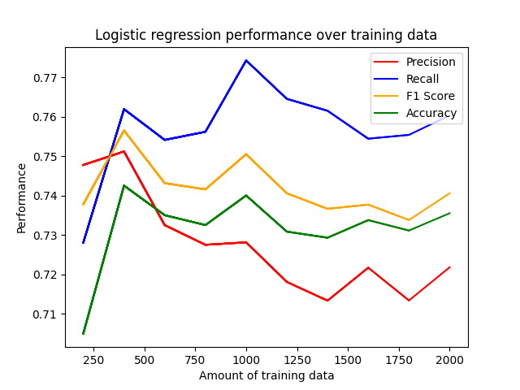
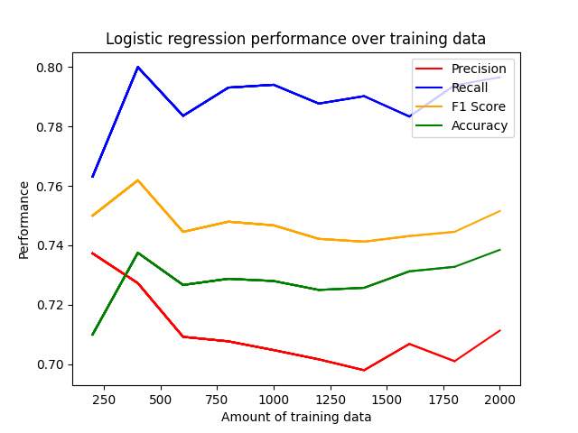
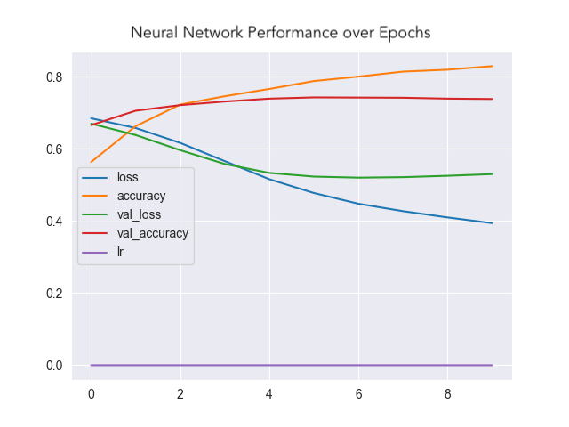
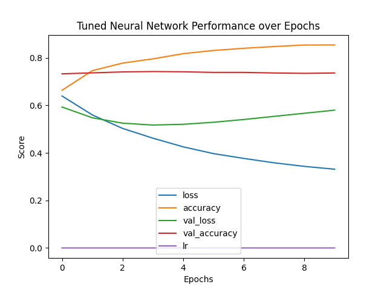
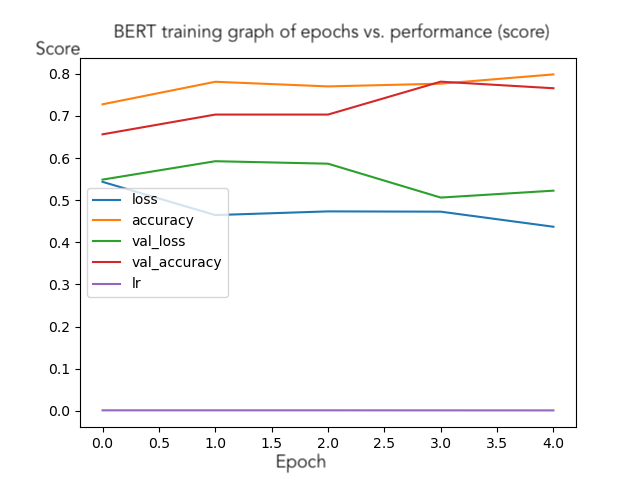
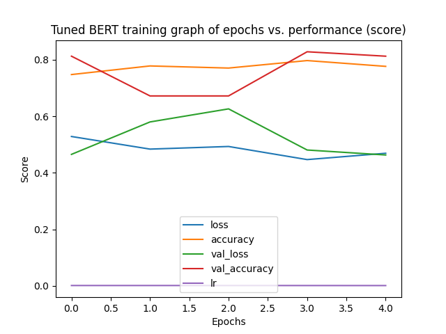

# SNS-Sentiment-Analysis

Analyze social media / SNS texts by measuring the likeliness of potential inflammatory / offensive language.

# Table of Contents
1. [Documentation & Instructions](#documentation--instructions)
   - [Classification](#classification)
   - [Version & Package requirements](#version--package-requirements)
   - [How to use the models](#how-to-use-the-models)
   - [Using other models](#using-other-models)
     - [Logistic Regression](#logistic-regression)
     - [Neural Networks](#neural-networks)
     - [TFBert Model](#tfbert-model)
2. [Results](#results)
   - [Logistic Regression (LR)](#logistic-regression-lr)
     - [LR Graph](#lr-graph)
     - [Tuned LR Graph](#tuned-lr-graph)
   - [Feedforward Neural Network (FFNN)](#feedforward-neural-network-ffnn)
     - [FFNN Graph](#ffnn-graph) 
     - [Tuned FFNN Graph](#tuned-ffnn-graph)
   - [TFBert (BERT)](#tfbert-bert)
     - [BERT Graph](#bert-graph)
     - [Tuned BERT Graph](#tuned-bert-graph)
   - [Key Takeaways](#key-takeaways)
3. [References & Datasets](#references--datasets)

# Documentation & Instructions

Contains the semantics and instructions for interacting with the project. 

## Classification
Regarding the datasets, all texts have a binary label of either `0` or `1`. 
- `0` = not inflammatory / not offensive
- `1` = inflammatory / offensive

The models make predictions as a probability in range `[0, 1]`—the model won't explicity predict `0` or `1`.

## Version & Package requirements
Testing & Working Python Versions:
- 3.9.6
- 3.11.5
- (Most likely versions after 3.8)

| **Package**      | **Import Name** | **Version** |
|------------------|-----------------|-------------|
| scikit-learn     | sklearn         | 1.3.2       |
| Jupyter Notebook | notebook        | 7.0.6       |
| Matplotlib       | matplotlib      | 3.8.1       |
| TensorFlow       | tensorflow      | 2.14.0      |
| Transformers     | transformers    | 4.35.0      |

**Notice:** Transformers may install data into your cache to get the pre-trained BERT models to function. 
This is normal if you've never downloaded the pre-trained data.

## How to use the models
1. Open `main.py` and run it, no arguments required.
2. Follow instructions in the terminal for selecting the model and inputting text.

## Using other models
You can modify the `main.py` to experiment with other models.

### Logistic Regression
All the Logistic Regression models can be loaded using pickle. 
In the line that loads the Logistic Regression, you may change the path to the model. 
Both plain and tuned models can be loaded directly without further procedure.

### Neural Networks
In the line that loads the neural network, you may simply change the path to a different model that contains a label with `nn`, this will not work for BERT models since they have their own loading function. 
Both plain and tuned models can be loaded directly.

### TFBert Model
To load a plain TFBert model, you must create an instance using the `__create_bert_model` function then load its weights. 
You may comment/uncomment the code and/or comment the prior code that loads the tuned model as well. 
The example for `main.py` is written below.
```python
bert = __create_bert_model()
bert.load_weights('./models/sns_bert.weights.h5')
models['bert']: TFBertModel = bm
```

Loading a tuned TFBert model with its hyperparameters has another procedure which requires you to create an instance using the `__create_tuned_bert_model` function and pass its hyperparameters.
You may comment/uncomment the code and/or comment the other loading procedures regarding the BERT model.
The example for `main.py` is written below.
```python
with open('./models/sns_tuned_bert_hp_config.json', 'r') as f:
    hp_config = json.loads(f.read())
    f.close()
hp = kt.HyperParameters().from_config(hp_config)
tuned_bert = __create_tuned_bert_model(hp)
tuned_bert.load_weights('./models/sns_tuned_bert.weights.h5')
models['bert']: TFBertModel = tuned_bert
```

# Results
## Logistic Regression (LR)
This model was the project's baseline model to compare against more complex models such as feedforward neural network and BERT.
The LR was manually tuned several times then automatically tuned after performing a grid search.

### LR Graph
The regular LR had a decent accuracy but its results were generally unsure about many inflammatory texts unless it was outright explicit. 
It was manually tuned.


### Tuned LR Graph
The tuned LR had a slightly better accuracy since the hyperparameters were close to the manually tuned counterpart. 
Additionally, the accuracy had a more consistent positive trend.
Performance was a bit better predicting input sentences.


## Feedforward Neural Network (FFNN)
An evaluated model to predict inflammatory speech. 
The FFNN was generally more accurate than the Logistic Regression and also performed better than the BERT model.
To account for potential over-fitting in both models, there was a learning rate scheduler to decay the learning rate.

### FFNN Graph
The FFNN had an acceptable trend where the losses were decreasing and the accuracies were increasing. 
They eventually started to reach a consistent "curve" which meant the model was generally performing well.
The tuned model was more confident with inflammatory texts but sometimes had drawbacks with texts that were more implied.
Additionally, the neural networks, handled longer texts better than all the other models.



### Tuned FFNN Graph
The tuned FFNN performed somewhat better than the regular FFNN. 
The validation accuracy remained relatively consistent but the accuracy increasing in a positive trend.
The loss had a negative trend but the validation loss almost went into a positive trend so 10 epochs seemed to be the limit.



## TFBert (BERT)
The BERT model was the newest model and was also already pretrained on data. 
Similar to LR, it was also unsure about its results. However, it seemed better at predicting non-inflammatory content opposed to inflammatory content.
When it was tuned, it did better with identifying explicit inflammatory text overall, but only did slightly better with long text.
However, the tuned BERT model still performed slightly better than all other models.

### BERT Graph
The BERT model had a similar trend to the FFNNs, but was more inconsistent and less accurate.
By the time it was done training, a desired trend happened but was still a bit unsure.



### Tuned BERT Graph
The tuned BERT model had a similar trend to its non-tuned counterpart, only that the trend is much more inconsistent and unsure.
The accuracies were about the same when training concluded.



## Key Takeaways
- Of all regular models, the feedforward neural network performed best.
- Of all tuned models, the BERT performed best (slightly).
- In general, the regular feedforward neural network performed the best.

# References & Datasets

- https://www.kaggle.com/datasets/waalbannyantudre/hate-speech-detection-curated-dataset
- https://www.kaggle.com/datasets/surekharamireddy/malignant-comment-classification